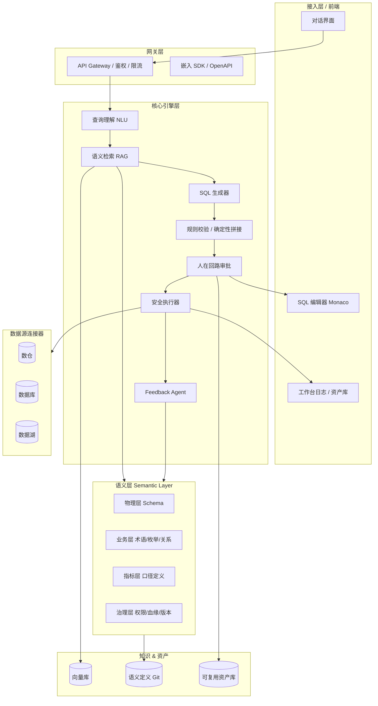
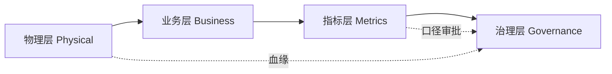
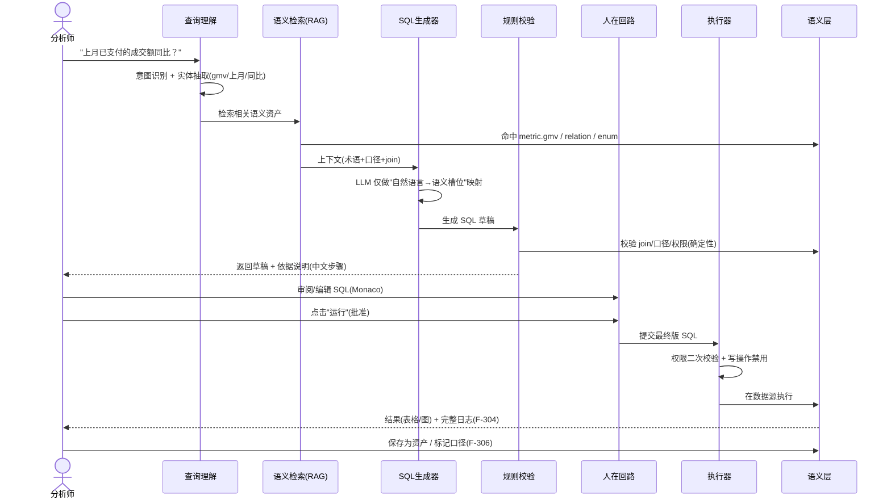

# ChatBI 技术架构与语义层设计方案

> 文档类型：技术设计 · 架构方案
> 对应产品定位：**数据分析师 / 工程师的 AI 副驾（Copilot for Analytics）**
> 配套文档：① 市场与竞品分析 ② 竞品功能点逐项拆解表 ③ 访谈提纲 ④ PRD 功能清单
> 版本：v1.0 · 编制：2026-08

---

## 一、设计目标与原则

| 原则 | 含义 | 对应 PRD |
|------|------|----------|
| **语义层优先** | join、口径、权限由语义层"锁死"，LLM 只做映射，不自由发挥 | F-201/203 |
| **确定性兜底** | 语义层可确定的部分用规则引擎生成，LLM 不碰最终 SQL 的确定片段 | F-301 |
| **人在回路（HITL）** | SQL 须经用户审阅/批准才执行，杜绝自动跑数 | F-303 ★ |
| **全链路可审计** | 提问→生成→改写→执行→结果全程留痕、可回放 | F-304 ★ |
| **跨源中立** | 不绑定单一数仓，连接器可插拔 | F-501 |
| **私有化友好** | 推理/存储/执行均可 offline，数据不出域 | F-502 |

> 核心架构决策：**不走"纯 NL2SQL 直出"路线**（竞品踩坑点）。采用「语义层引导 + LLM 映射 + 规则确定性拼接 + 人在回路」的混合管线，把幻觉风险压到最低。

---

## 二、总体架构



---

## 三、分层模块设计

### 3.1 接入层（前端）
- **对话界面**：多轮上下文、澄清反问、结果卡（表格/图）。
- **SQL 编辑器（Monaco）**：高亮、补全、可编辑草稿（F-302）。
- **工作台日志**：全链路时间线回放（F-304）。
- **资产库 UI**：保存/搜索/共享查询与指标（F-306）。

### 3.2 网关层
- 鉴权（OAuth2/SSO）、租户隔离、限流、审计日志落盘。
- 开放 API 与 iframe/SDK 嵌入（F-505）。

### 3.3 核心引擎层（关键管线，详见第五节）

### 3.4 数据源连接器（跨源中立，F-501）
- 连接器插件化：Postgres / MySQL / Hive / ClickHouse / 厂商数仓。
- 统一查询方言（dialect）抽象层，生成 SQL 后按目标库转译。
- 连接配置 ≤10 分钟，权限继承底层（F-205/F-503）。

### 3.5 安全与权限层（贯穿全栈）
- 行列级权限在**语义层 + 执行器**双层强制（F-503）。
- 越权提问返回"无权限"，不泄露表结构（F-205 AC2）。

---

## 四、语义层详细设计（核心）

> 这是产品的护城河，也是"可信"的基石。采用**声明式语义定义 + Git 版本管理**，对分析师/工程师友好、可 Review、可 diff、可回滚。

### 4.1 分层模型



| 层 | 职责 | 关键对象 | 对应 PRD |
|----|------|----------|----------|
| **物理层** | 描述真实库表结构 | `source` / `table` / `column` / `type` / 注释 | F-201 |
| **业务层** | 业务语义映射 | `synonym`（同义词）、`enum`（枚举值业务含义）、`relation`（join 关系） | F-202 |
| **指标层** | 唯一事实源 | `metric`（原子/派生指标、计算逻辑、口径说明） | F-203 |
| **治理层** | 管控 | `permission`（行列级）、`lineage`（血缘）、`version`、`approval` | F-205/F-503 |

### 4.2 语义定义格式（YAML 示例）

```yaml
source:
  - name: sales_dw
    type: hive
    tables:
      - name: orders
        columns:
          - {name: total_amount, type: bigint, comment: "实付金额(单位:分)"}
          - {name: status, type: int, enum: order_status}

enum:
  order_status:        # 枚举值业务含义（F-202）
    "1": "已支付"
    "2": "已退款"

relation:              # join 关系锁死（确定性）
  - from: orders
    to: users
    on: orders.user_id = users.id

metric:                # 指标层：口径唯一（F-203）
  - name: gmv
    label: "成交额"
    expr: "sum(total_amount)/100"
    source: orders
    filters: ["status = 1"]
    note: "已支付订单的实付金额，单位元"

synonym:               # 同义词（F-102）
  - word: ["成交额","GMV","流水"]
    maps_to: gmv
```

### 4.3 为什么这样设计
- **join 与口径被锁死**：LLM 不再"猜"关联条件，只从 `relation`/`metric` 取，幻觉源被切断（对应 R1 风险缓解）。
- **Git 管理语义**：每次变更有 PR、有 diff、可回滚，天然满足"治理 + 可审计"。
- **feedback 闭环**：用户改写 SQL 后，系统可反向提议更新 `enum`/`synonym`/`metric`（F-204）。

---

## 五、查询生成管线（端到端）



**关键设计点**
1. **LLM 只做映射，不写确定性 SQL**：join、口径、枚举翻译全部来自语义层（确定性），LLM 负责把口语填进语义槽位。
2. **规则校验兜底**：生成后强制校验语法、权限、join 正确性，不通过则进入澄清（F-104）。
3. **人在回路是硬关卡**：默认不自动执行（F-303 AC1）；写操作强制二次确认或禁用。

---

## 六、人在回路与可审计设计（★ 差异化）

| 能力 | 实现 | PRD |
|------|------|-----|
| SQL 可见 | 默认展示完整 SQL + 权威注释 | F-301 |
| 可编辑 | Monaco 编辑器，改动后重新校验 | F-302 |
| 批准执行 | 显式"运行"按钮，写操作二次确认 | F-303 |
| 全链路日志 | 结构化事件流：提问/各版SQL/数据源/耗时/结果摘要 | F-304 |
| 一键回放 | 历史问答可复现 | F-304 AC2 |
| 版本差异 | 记录"原始生成版 vs 最终版" diff | F-302 AC2 |

日志采用不可变追加写（append-only），与数据分析事件分离，满足审计可追溯。

---

## 七、安全与权限架构

- **双层权限**：语义层定义行列级策略 → 执行器在拼接 SQL 时注入 `WHERE`/`列投影`（F-503）。
- **最小暴露**：未授权字段不进入可问范围，错误信息不泄露结构（F-205 AC2）。
- **私有化**：向量库、语义存储、LLM 推理均可在 VPC/离线环境，数据不出域（F-502）。
- **审计**：所有操作留痕，配合企业 SSO 与操作审计导出。

---

## 八、技术选型建议

| 层 | 推荐 | 说明 |
|----|------|------|
| LLM（可插拔） | OpenAI / 通义千问 / DeepSeek / 本地微调(SQLCoder) | 私有化走本地或自托管推理 |
| 语义层存储 | YAML+Git（主） + 关系表（运行时缓存） | 工程师友好、可 Review |
| 向量库 | pgvector / Milvus | RAG 检索语义资产，支持私有化 |
| 后端 | Python(FastAPI) + 工作流编排 | NLP/数据生态成熟 |
| 前端 | React + Monaco Editor + 图表库 | 对话 + SQL 编辑 + 可视化 |
| 执行 | 各数据源原生驱动 + dialect 转译 | 跨源中立 |
| 部署 | 容器化 / K8s / 离线镜像 | 支持私有化 |

---

## 九、演进路线与风险

| 阶段 | 架构重点 | 风险与缓解 |
|------|----------|------------|
| **M1 内核** | 语义层 + 生成管线 + HITL + 跨源执行 | 一次可执率不足 → 语义层引导 + 规则兜底 |
| **M2 差异化** | feedback agent（F-204）、资产沉淀（F-306）、私有化（F-502） | 语义冷启动慢 → 元数据自动拉取 + RAG |
| **M3 壁垒** | 归因/预警/报告（F-403~405）、Agent 化（F-601~603） | Agent 失控 → 多步可暂停人工确认 |

**核心风险 R1（幻觉/可执率）的架构级缓解**：确定性语义层 + 规则校验 + 人在回路，三层共同把"CheatBI"概率压到最低——这是本方案相对纯 NL2SQL 竞品的**结构性优势**。

---

> 至此技术蓝图完成。配套交付物：市场分析 → 竞品拆解 → 访谈提纲 → PRD 功能清单 → **技术架构与语义层设计方案**。下一步可做：MVP 代码原型（前端对话 + 取数/可视化，mock 数据先跑通语义层管线），或语义层 YAML Schema 规范定义。
